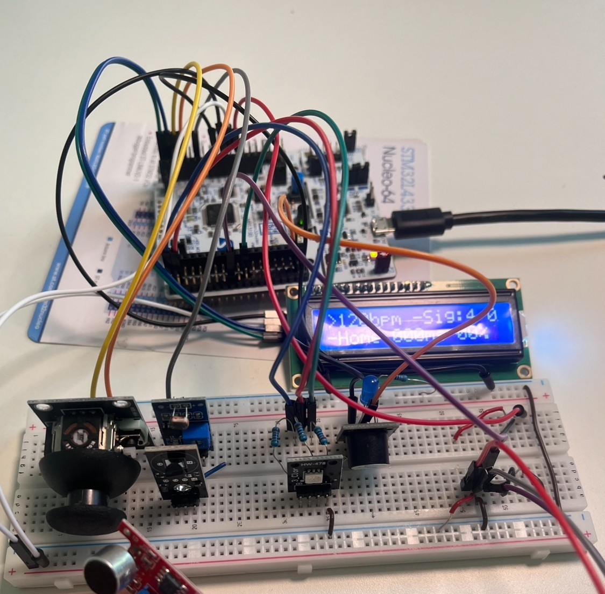

# Interactive Rhythm Trainer (STM32, HAL, C)

* [Application Overview](#application-overview)
* [Key Features](#key-features)
* [Hardware & Peripherals Used](#hardware--peripherals-used)
* [System Architecture](#system-architecture)
* [Event System](#event-system)
* [Rhythm Detection (Microphone Processing)](#rhythm-detection-microphone-processing)
* [Menu System](#menu-system)
* [Media References](#media-references)
* [Design Reflection (OOAD Perspective)](#design-reflection-ooad-perspective)

---

This project is an embedded rhythm-training application developed for a Microcontrollers course using an STM32 (ARM Cortex-M) microcontroller and the STM32 HAL.

The system focuses on **real-time signal processing**, **event-driven architecture**, and **tight integration between hardware abstraction and application logic**.

---

## Application Overview

The system runs entirely on the STM32 and provides three rhythm‑related modes accessible through a **joystick‑driven menu rendered on a character LCD**.

### Main Screens / Modes

**Metronome**
Generates a steady tempo using a buzzer and LED feedback. The BPM is user‑selectable through the joystick‑driven menu, allowing real‑time tempo changes.

**Clap BPM Detection**
Uses microphone input to detect user claps and estimate BPM in real time. This mode demonstrates **ADC + DMA signal acquisition**, peak detection, and timing analysis.

**Training / Accuracy Mode**
Users clap along to a target tempo and receive timing accuracy feedback. The system measures clap timing offsets relative to expected beats and computes accuracy statistics over time.

---

## Key Features

* Custom **event‑driven architecture**
* Fully **joystick‑driven menu system** rendered on LCD
* Multiple operating modes (metronome, BPM detection, training)
* Real‑time microphone signal processing
* Visual (LCD, LEDs) and audio (buzzer) feedback
* Accuracy and timing statistics for rhythm training
* Strong separation between hardware abstraction, application logic, and UI

---

## Hardware & Peripherals Used

* **STM32 microcontroller (ARM Cortex‑M)**
* **I2C** – Character LCD interface
* **ADC + DMA** – Microphone sound sensor and joystick analog inputs
* **GPIO / EXTI** – Button input handling (joystick)
* **Timers / PWM** – Buzzer output and RGB LED timing

---

## System Architecture

The project is structured around a **central event system**. Hardware modules never directly control application logic or UI; instead, they **generate events** that are handled centrally based on the current system state.

### High‑Level Flow

```
Hardware input → Event → Central dispatcher → Active subsystem
```

This architecture avoids tight coupling, reduces duplicated logic, and allows each module to remain focused on a single responsibility.

---

## Event System

The event system acts as the backbone of the application.

```c
Event event;
if (Event_Pop(&event)) {
    EVENT_handle(&event);
}
```

* Events are pushed by hardware‑level modules (joystick, microphone, timers)
* A central handler dispatches events to the appropriate subsystem
* Behavior changes naturally with system mode, without branching inside drivers

Example joystick event routing:

```c
void EVENT_handle_joystick_event(Event* event) {
    JOYSTICK_handle_event(hsystem_state.current_menu, event);
}
```

---

## Rhythm Detection (Microphone Processing)

Rhythm and clap detection is one of the most critical parts of the system and is handled inside the microphone abstraction layer.

### Detection Strategy

* Microphone sound sensor input is sampled using **ADC + DMA**
* A **dynamic noise floor** is maintained using a moving average
* A clap is detected when:

  * The signal rises above a threshold relative to the noise floor
  * A valid falling edge confirms a peak (prevents false positives)
* Time between detected claps is measured
* A smoothed average interval is maintained
* BPM is calculated as:

```
BPM = 60000 / average_interval_ms
```

* A `ready` flag is set once BPM stabilizes

### Hardware Abstraction Example

```c
void MIC_process_event(MICType* mic, EventQueueType* evq) {
    if (MIC_update_bpm(mic, HAL_GetTick())) {
        EVENT_que_push_back(evq, (Event){EVENT_SOUND_DETECTED});
    }
}
```

This design ensures:

* No UI or mode‑specific logic exists inside the microphone driver
* BPM detection can be reused by multiple modes (display, training, statistics)

### Training Accuracy Analysis

During training mode:

* Each clap is timestamped
* The expected beat time is known from the target BPM
* The timing offset (early/late) is computed
* Accuracy percentage is calculated and averaged over time

---

## Menu System

The menu system is **fully data‑driven** and tightly integrated with the event system. Menus are not hardcoded; instead, they are defined through structures and callbacks.

### Menu Definition Example

```c
MenuItemType menu_items_home[] = {
    {MENU_ITEM_STATIC_TEXT, 1, 0, 0, "Play", NULL, &MENU_change, &menu_bpm_play},
    ...
};

MENU_init(&menu_home, &hsystem_state.hlcd, MENU_TYPE_HOME,
          menu_items_home, 4);
```

Menus support:

* Static, dynamic text
* Dynamic values (BPM, accuracy, timing)
* Navigation and action items

---

## Menu System Structures

### MenuType

```c
typedef struct MenuType {
    TextLCDType* lcd;
    MenuInstanceType instance;
    MenuItemType* menu_items_non_sel;
    MenuItemType* menu_items_sel;
    uint8_t item_count_non_sel;
    uint8_t item_count_sel;
    uint8_t selected_index;
} MenuType;
```

### MenuItemType

```c
typedef struct MenuItemType {
    MenuItemFormatType format;
    uint8_t is_selectable;
    uint8_t col;
    uint8_t row;
    char text_format[MENU_MAX_TEXT_LENGTH+1];
    MenuCallback update_callback;
    MenuCallback action_callback;
    void* in_action_callback;
    char text_buffer[MENU_MAX_TEXT_LENGTH+1];
} MenuItemType;
```

### Why This Design Is Powerful

* Each menu item owns its **behavior** via callbacks
* `update_callback` allows live values without UI logic duplication
* `action_callback` cleanly triggers state changes or events
* Menu logic is entirely decoupled from application modes
* Works seamlessly with the joystick event system

### Joystick Press Integration

```c
void JOYSTICK_handle_event(MenuType* menu, Event* event) {
    if (event->type == EVENT_JOYSTICK_PRESS) {
        MenuItemType* current_item =
            &menu->menu_items_sel[menu->selected_index];
        current_item->action_callback(current_item->in_action_callback);
    }
}
```

---

## Media References



[Menu Navigation Demo](docs/Menu_selection_joystick.mov)

---

## Design Reflection (OOAD Perspective)

This project was developed prior to my formal experience with Object-Oriented Analysis and Design (OOAD). It follows a procedural, event-driven style typical of embedded C, using shared state and function-pointer–based abstraction.

With my current OOAD knowledge while keeping the same language and platform (C on STM32), the design would be refined as follows:

### 1. Event System: Ownership & Responsibility

**OOAD issue**

* Event ownership, handling responsibility, and lifecycle are implicit and depend on global interpretation and external system state.

**OOAD-in-C improvement**

* Define explicit **event ownership contracts** where each event type has a single owning subsystem responsible for handling behavior and side effects.
* Replace global dispatch with **object-level handlers**, for example:

  ```c
  RhythmController_HandleEvent(&rhythm, &event);
  MenuController_HandleEvent(&menu, &event);
  ```

This corresponds to embedded implementations of the **Command** and **Observer** patterns using C structs and function interfaces.

---

### 2. System State vs Explicit Domain Objects

**OOAD issue**

* Shared global system state creates coupling between subsystems and forces implicit dependencies on mode flags and external context.

**OOAD-in-C improvement**

* Model major subsystems as **long-lived domain objects** (e.g., `RhythmController`, `TrainingSession`, `MenuController`) that own their internal state and expose narrow APIs.
* Reduce the global system state to a **routing and lifecycle coordinator** rather than a shared data container.

This reflects OOAD principles of **encapsulation and aggregate ownership**, implemented in C via disciplined interfaces.

---

### 3. Menu System: Explicit Ownership and Lifecycle

**OOAD issue**

* Menu behavior is driven externally, with input handling, selection changes, and rendering controlled outside the menu’s ownership boundary.

**OOAD-in-C improvement**

* Promote the menu to an **active UI controller object** responsible for input handling, selection state transitions, and rendering decisions.
* Interact with the menu only through explicit interfaces, for example:

  ```c
  Menu_HandleEvent(&menu, &event);
  Menu_Update(&menu);
  ```

This formalizes menu ownership and reduces coupling between input handling, UI logic, and system state.

---

### 4. Rhythm Detection & Training Logic Decomposition

**OOAD issue**

* Clap detection, tempo estimation, and training analysis are combined along a single control path, coupling multiple responsibilities.

**OOAD-in-C improvement**

* Decompose rhythm functionality into explicit single-responsibility components:

  * `ClapDetector` - signal processing and clap detection
  * `TempoEstimator` - interval smoothing and BPM calculation
  * `TrainingAnalyzer` - timing offset and accuracy evaluation
* Compose these components explicitly instead of conditionally reusing logic.

This preserves existing algorithms and performance while improving responsibility boundaries.